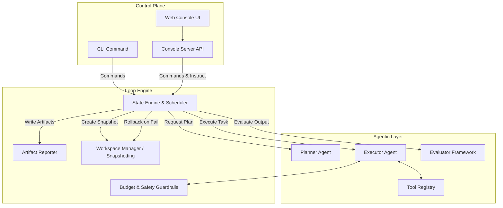
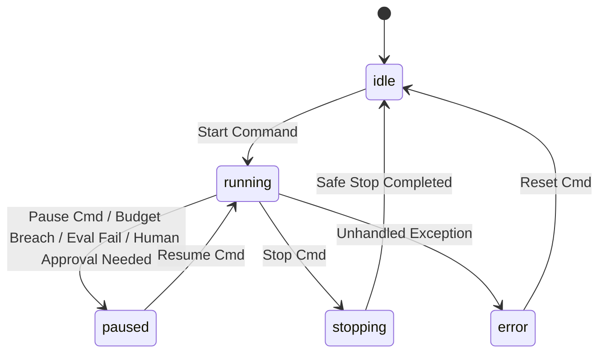

# AutoLoop Architecture Design Document

## 1. System Overview

AutoLoop is designed as a generalized, autonomous task loop framework. It is intended to repeatedly execute tasks (Rounds) towards a defined overarching goal. Goals are domain-agnostic and defined by the user. To achieve "generalized work," the system is strictly decoupled: the core Engine knows nothing about *what* work is being done; it only knows how to schedule, budget, plan, execute, evaluate, and rollback rounds based on abstracted plugins (Tools and Evaluators).

### Core Philosophy
- **Extensibility via Interfaces:** Tools, Evaluators, and Workspaces must implement strict, typed interfaces.
- **Fail-Safe by Default:** Execution is bounded by multidimensional budgets (Cost, Time, Actions). Breaching a budget triggers an immediate halt and rollback.
- **Human-in-the-Loop:** Real-time instructions and manual approvals are first-class citizens in the state machine.

---

## 2. High-Level Component Architecture

The system consists of three main logical layers:
1. **Control Plane (UI/API/CLI):** Handles user interaction, status reporting, and starting/stopping the loop.
2. **Loop Engine (Orchestrator):** Manages the state machine, scheduling, resource budgets, and persistence.
3. **Agentic Layer (Execution):** The intelligence layer that plans tasks, invokes tools, and evaluates outcomes.



---

## 3. Core Component Details

### 3.1 Loop Engine (`src/loop/engine.ts`)
The orchestrator of the system. It runs the main `while(true)` loop.
- **Responsibilities:**
  - Acquires and releases file locks (`loop.lock`).
  - Manages the State Machine (`idle`, `running`, `paused`, `stopping`, `error`).
  - Coordinates the transition from Planning -> Execution -> Evaluation -> Reporting.
  - Implements the Cooldown sleep timer.

### 3.2 Workspace Manager (`src/environment/workspace.ts`)
An abstraction over the environment the agent is mutating.
- **Responsibilities:**
  - **Snapshotting:** Creates a point-in-time backup before a round starts (e.g., `git stash`, temp branch, DB transaction).
  - **Rollback:** Restores the environment if the Evaluator fails or Guardrails are breached.
  - **Diffing:** Generates the `state_change.txt` artifact for the Reporter.

### 3.3 Planner Agent (`src/agent/planner.ts`)
An LLM wrapper responsible for strategy.
- **Input:** Global Goal (`goal.md`), recent run history, active tools, and real-time Human Instructions.
- **Output:** A single, actionable sub-task bounded by the current budget.

### 3.4 Executor Agent (`src/agent/executor.ts`)
An iterative reasoning and acting loop (e.g., ReAct or Tool-Calling architecture).
- **Responsibilities:**
  - Attempts to solve the task given by the Planner.
  - Dynamically invokes tools from the `ToolRegistry`.
  - Handles intermediate tool errors (e.g., fixing a syntax error after a failed test run).
  - Constantly checks with the `Guardrails` before every tool invocation.

### 3.5 Tool Registry (`src/agent/tool-registry.ts`)
The collection of capabilities available to the Executor.
- **Design:** Every tool must implement a standard `Tool` interface.
  ```typescript
  interface Tool {
    name: string;
    description: string;
    schema: JSONSchema; // For LLM tool binding
    execute: (args: any) => Promise<ToolResult>;
    costEstimate: (args: any) => number; // Cost in Actions or Time
  }
  ```
- **Built-ins:** `run_shell`, `read_file`, `write_file`, `http_request`.

### 3.6 Evaluator (`src/evaluation/evaluator.ts`)
Determines if a round was successful.
- **Design:** Evaluators are pluggable.
  ```typescript
  interface Evaluator {
    evaluate: (context: RoundContext) => Promise<EvaluationResult>;
  }
  ```
- **Implementations:**
  - `ShellEvaluator`: Runs a command (e.g., `npm test`). Pass if exit code is 0.
  - `LLMJudgeEvaluator`: Prompts an LLM to review the `state_change.txt` against the task description.
  - `WebhookEvaluator`: Calls an external API to verify goal-defined outcome metrics.

### 3.7 Guardrails & Budgets (`src/agent/guardrails.ts`)
The safety net. Tracks consumption during the Executor's run.
- **Tracking:**
  - **Cost:** Accumulated LLM Token usage (USD).
  - **Time:** Stopwatch from round start.
  - **Actions:** Counter of tool invocations.
- **Action:** If a limit is hit, it throws a `BudgetBreachError`, forcing the Engine to abort the round, rollback via Workspace, and enter the `paused` state.

---

## 4. Data Flow & State Management

### 4.1 State Machine Transitions



### 4.2 Data Persistence (Artifacts)
All state is file-based (MVP) under `AUTOLOOP_HOME` (default `.autoloop/`).
- `loop.lock`: PID and current state.
- `runs/`: Directory for historical data.
  - `[timestamp].round.log`: Raw execution logs (with silent secret redaction).
  - `[timestamp].round.summary.md`: LLM-generated summary.
  - `[timestamp].round.metrics.json`: Budgets consumed, duration.
  - `[timestamp].round.state_change.txt`: The diff/patch.

---

## 5. Security & Isolation Strategy

Rather than trying to build a perfect sandbox, AutoLoop relies on **Recoverability and Redaction**:
1. **Secret Redaction (Logging level):** A custom logger middleware scans all outgoing text (Logs, Summaries, Console stdout) against a list of known secrets (loaded from `.env`) and replaces them with `[REDACTED]`. The Agent still has the actual strings in memory to make API calls, but they never leak to disk.
2. **The "Undo" Button (Workspace level):** No round is permanent until evaluated. The `WorkspaceManager` ensures that whatever the Agent does (modifying files, changing DB schemas in a staging environment) is wrapped in a transactional or snapshot context.

---

## 6. Extensibility Guide (For Future Developers)

To add new capabilities to AutoLoop, developers will primarily interact with two interfaces:

**1. Adding a New Tool (e.g., Browser Automation):**
Implement the `Tool` interface. Register it in the `ToolRegistry` during Engine boot. The Executor will automatically expose its schema to the LLM.

**2. Adding a New Evaluator (e.g., Visual Regression):**
Implement the `Evaluator` interface. Update the configuration (`AUTOLOOP_EVALUATOR_TYPE=visual`) to route validation logic to the new class.

## 7. API Contract (Console Server)

The internal REST API allows the Web Console and CLI to control the Engine asynchronously.

- `POST /api/loop/instruct`:
  - **Payload:** `{ "message": "string" }`
  - **Behavior:** Appends the message to the current human feedback queue. The Engine injects this into the Planner's prompt at the start of the next round.
- `GET /api/status`:
  - **Returns:** Current state, current round number, active budget consumption (Cost, Time, Actions).
