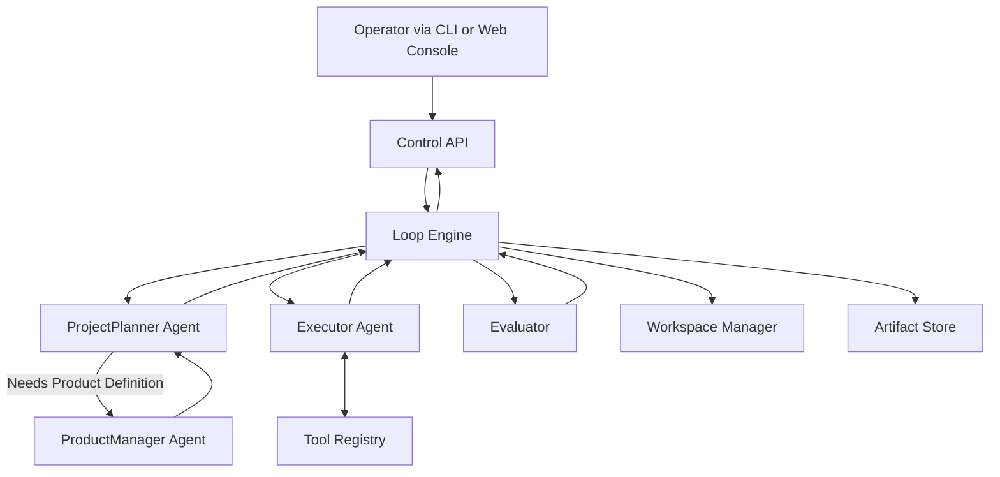
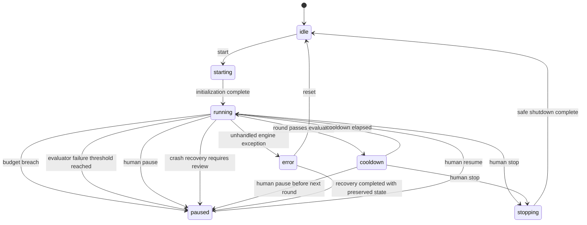

# AILoop Architecture

## 1. Purpose

AILoop is a goal-driven autonomous loop runner. The MVP architecture exists to make each round:

- outcome-oriented,
- observable,
- budget-bounded,
- recoverable where the environment allows,
- and interruptible by a human operator.

This document is the technical contract for implementing the MVP described in `README.md`. It defines runtime boundaries, round lifecycle, persistence layout, evaluator behavior, and the pause semantics required when safety or quality gates fail.

## 2. Architectural Principles

The MVP follows nine implementation principles derived from the product goal:

1. **One measurable round at a time.** The system advances through small, atomic rounds instead of open-ended autonomous execution.
2. **Control plane separated from execution plane.** UI and CLI issue commands, while the loop engine owns scheduling, budgets, and state transitions.
3. **Product definition, project planning, execution, and evaluation are distinct contracts.** Requirement shaping, round-level task selection, acting, and judging must be swappable and independently testable.
4. **Artifacts are first-class outputs.** Each round must leave behind reviewable files that explain what happened.
5. **Cross-agent and operator-facing handoffs must stay compact and navigational.** Agents and human governance surfaces should receive concise evidence briefs, artifact manifests, and targeted excerpts by default instead of raw log dumps or full artifact bodies.
6. **Human-facing observability must use progressive disclosure.** The Web Console should present summary-first status, clear sectioning, expand/collapse, pagination, and drill-down artifact access instead of dumping all available data into one view.
7. **Mandatory source sets must be explicit and tiered.** Runtime roles should read a small, fixed canonical set first, then expand only when a declared information gap remains.
8. **Pause is the default safety response.** Budget breaches, repeated evaluator failures, crash recovery, and explicit human intervention all converge on a paused state.
9. **Internal runtime agents must be isolated from external development-assistant guides.** Repository-local `AGENTS.md` files, skill catalogs, and collaborative coding workflows intended for humans building AILoop must not silently alter the behavior of ProductManager, ProjectPlanner, Evaluator, or other internal runtime agents.

Normalized terminology used throughout this document:

- **Summary-first** means the system presents the smallest useful overview before deeper detail.
- **Navigational handoff** means one role passes concise summaries, artifact manifests, and targeted excerpts instead of wholesale raw context.
- **Progressive disclosure** means full evidence stays available, but human-facing surfaces reveal it through sectioning, expand/collapse, pagination, or explicit drill-down.

## 3. MVP System Boundaries

### In Scope

- Single-run loop engine for one workspace.
- File-based persistence under `AILOOP_HOME`.
- ProjectPlanner, optional ProductManager, Executor, and Evaluator agent contracts.
- Tool registry abstraction for local shell, file, and HTTP tools.
- Resource budget enforcement across cost, time, and action count.
- Web console and CLI for start, pause, resume, stop, and instruct flows.
- Recoverable round flow when the environment supports rollback.

### Out of Scope

- Multi-tenant orchestration.
- Billing, quotas across organizations, or hosted marketplace concerns.
- Perfect sandboxing of every tool side effect.
- Distributed workers or horizontal scaling.

## 4. Runtime Components

The MVP is organized into six runtime subsystems.

### 4.1 Control Plane

Interfaces used by the operator.

- **CLI** issues direct lifecycle commands such as `start`, `pause`, `resume`, `stop`, and `status`. It manages the production server as a background process using `nohup` and PID-file tracking to ensure full environment inheritance from the user's shell.
- **Web Console** shows current state, budgets, recent rounds, artifacts, and accepts live instructions through summary-first, sectioned views. It should rely on progressive disclosure such as expand/collapse, pagination, and drill-down artifact access instead of rendering full logs or artifact bodies inline by default.
- **Console Server API** is the transport boundary between user-facing controls and the loop engine.

The control plane never executes round logic directly. It writes commands and instructions into engine-managed state.

### 4.2 Loop Engine

The engine is the orchestrator and state machine owner.

Primary responsibilities:

- load persisted run state and pending operator instructions,
- acquire run/workspace lock before mutating execution state,
- schedule the next round when the run is eligible,
- coordinate project-planner → executor → evaluator flow, with optional ProductManager activation when requirement artifacts need to be created or refreshed,
- enforce cooldowns and pause rules,
- request rollback when a round fails catastrophically,
- write round artifacts and update run summaries.

### 4.3 Agent Layer

The agent layer contains multiple role-separated contracts, allowing planning, acting, judging, and governance to be independently managed:

- **ProjectPlanner** converts goal + history + operator instructions + current requirement artifacts into exactly one atomic `SubTask`. It owns round-level workflow progression.
- **ProductManager** produces and refreshes human-readable Markdown requirement artifacts when product definition is missing, stale, or complete for the current slice.
- **Executor** performs an observe → reason → act loop using registered tools until the `SubTask` succeeds, fails, or budget expires.
- **Evaluator** verifies whether the observable state change satisfies the `SubTask` objective.
- **Leader** intervenes when the loop is paused due to repeated failures, analyzing metrics (Friction Index) and providing strategic instructions or escalation.
- **Designer** focuses on UI/UX, responsive layouts, and visual harmony, ensuring high-bandwidth UX.
- **CCB Experts (Senior Dev, QA Lead, Product Owner)** provide specialized governance and consensus before any change to the core mission, architecture, or "Constitution" is permitted.

The `ProductManager` is a runtime product-definition role. It is distinct from the governance-phase `Product Owner` CCB expert.

For requirement shaping, the `ProductManager` should consume a compact planning handoff with:

- a fixed mandatory source manifest,
- a runtime-safe policy brief distilled from `AGENTS.md`,
- the current requirement lifecycle state,
- and only the smallest optional source list needed for targeted expansion.

### 4.4 Tool Registry

The registry exposes environment capabilities in a normalized way.

MVP built-ins:

- `read_file`
- `write_file`
- `run_shell`
- `http_request`

Each tool declares schema, safety notes, and execution semantics so the executor can use tools deterministically.

### 4.5 Workspace Manager

The workspace manager abstracts the mutable environment.

Responsibilities:

- create a pre-round snapshot when supported,
- record round-level diffs or mutation summaries,
- restore previous state when rollback is required,
- expose workspace metadata to the engine and evaluator.

Examples of rollback strategy:

- Git-backed repo: diff + restore/reset.
- Transactional database: transaction or savepoint rollback.
- Non-recoverable environment: mark rollback as unsupported and pause for human review.

### 4.6 Artifact Store

The artifact store is a file-based history of every round and run.

It persists:

- logs,
- summaries,
- metrics,
- state-change patches,
- evaluator results,
- and current run state.

Artifact storage must preserve reviewable raw evidence, but cross-agent prompts and operator-facing console views should reference those artifacts through compact manifests, summaries, and drill-down navigation rather than inlining full files by default.

### 4.7 Runtime Agent Session Isolation

Codex sessions used by internal runtime agents must not inherit repository-local assistant instructions that are meant for external coding assistants working on the AILoop repository itself.

Minimum MVP requirements:

- runtime agent Codex sessions should run from an isolated scratch directory or equivalent isolated instruction context,
- if repo inspection is needed, prompts must provide the repository root explicitly and instruct the agent to use absolute paths or explicitly `cd` into the repo,
- the isolated session guide must tell the runtime agent to ignore external development-assistant skills and collaborative workflows,
- a failure to isolate runtime agents from external assistant instructions is a runtime bug, not acceptable emergent behavior.

## 5. High-Level Data Flow



Round flow:

1. Operator starts or resumes a run.
2. Engine loads state, checks lock, and confirms budgets remain available.
3. Engine captures a pre-round snapshot when supported.
4. ProjectPlanner decides whether the current requirement artifact is sufficient or whether ProductManager must refresh it.
5. ProjectPlanner emits one atomic `SubTask`.
6. Executor attempts the `SubTask` using registered tools.
7. Evaluator checks objective versus observed state change.
8. Engine writes artifacts, updates run state, and either enters cooldown, pause, or stop.

Evaluator handoff rule:

- the engine should pass a compact evidence brief first,
- include artifact paths and small, high-signal excerpts,
- avoid embedding full `round.log` or multi-hundred-kilobyte `state_change` bodies directly into evaluator prompts unless a narrow excerpt is required to resolve ambiguity.
- evaluator and other internal runtime roles must receive only the AILoop runtime role contract and engine-supplied context, not repository-local coding-assistant workflows.
- leader diagnostics and operator-facing summaries derived from the same artifacts should keep this summary-first, navigational shape by default.

## 6. Loop State Machine

The engine owns the canonical run state. State transitions must be explicit and persisted.

### 6.1 States

- `idle`: no active run.
- `starting`: run initialization is in progress.
- `running`: a round is actively being prepared, executed, or evaluated.
- `cooldown`: a round completed successfully and the engine is waiting before the next round.
- `paused`: execution is intentionally halted and requires human or explicit engine action to continue.
- `stopping`: engine is performing a safe shutdown at a round boundary or after an interruptible checkpoint.
- `error`: an unhandled internal failure occurred and the run requires explicit recovery.

### 6.2 Transition Rules



### 6.3 Pause Semantics

The system must pause instead of continuing when any of the following occurs:

- cost budget exceeded,
- time budget exceeded,
- action budget exceeded,
- evaluator fails repeatedly beyond configured threshold,
- crash recovery detects an interrupted round,
- rollback is required but cannot be completed automatically,
- an operator issues `pause`,
- or a guardrail blocks further autonomous action.

`paused` is not a failure by itself. It is a safe waiting state that preserves evidence and requires deliberate continuation.

## 7. Round Lifecycle

Each round follows the same deterministic lifecycle.

### 7.1 Phase 0: Preflight

The engine:

- confirms run is not locked by another active engine instance,
- loads current goal, prior summaries, pending instructions, and budgets,
- checks whether stop or pause was requested,
- creates a workspace snapshot if supported,
- opens a new timestamped artifact set.

### 7.2 Phase 1: Planning

ProjectPlanner input:

- goal,
- current requirement artifact summary,
- current workspace state summary,
- previous round outcome,
- pending human instructions,
- remaining round budget.

If product definition is missing, stale, or complete for the current slice, the engine must invoke `ProductManager` before finalizing the round task. The primary `ProductManager` output is a human-readable Markdown requirement artifact.

`ProductManager` handoff rule:

- the engine should pass a compact source manifest instead of relying on open-ended repository exploration,
- the mandatory set should include `README.md`, `ARCHITECTURE.md`, `AILOOP_ENGINE_WORKFLOW.md`, and `AGENTS.md`,
- `AGENTS.md` must enter runtime handoffs only through a runtime-safe policy brief that preserves project-level principles and excludes external coding-assistant workflows,
- optional plan or artifact sources should be listed as navigational candidates, not inlined wholesale,
- the `ProductManager` should expand beyond the mandatory set only after declaring a concrete missing-information gap.

ProjectPlanner output is strict JSON matching the `SubTask` contract:

```json
{
  "rationale": "why this is the best next step now",
  "objective": "one atomic imperative task",
  "expected_outcome": "observable signal of success",
  "recommended_tools": ["read_file", "run_shell"]
}
```

The ProjectPlanner must never emit multiple tasks in one round.

### 7.3 Phase 2: Execution

Executor behavior:

- reads target state before mutation,
- performs sequential tool actions by default,
- reasons over tool results,
- retries correctable errors up to the configured retry limit,
- checks budgets before every mutating step,
- verifies state after each write or external action,
- returns a machine-readable `ToolResult`.

### 7.4 Phase 3: Evaluation

The evaluator compares the `SubTask.objective` and `expected_outcome` against observed changes.

The evaluation context should be compact by default:

- task objective and expected outcome,
- executor status and summary,
- validation-result summary,
- compact state-change summary,
- artifact manifest with concrete paths to the round log, state-change file, metrics, and summary,
- and only the smallest targeted excerpts needed for judgment.

The same compact-by-default rule should apply when the engine packages pause diagnostics, leader handoffs, or operator-facing round summaries from the same evidence.

The engine must not treat engine-managed run artifacts such as `.ailoop/runs/*.round.log` as ordinary product workspace diffs when constructing the evaluator handoff.

Possible decisions:

- `pass`
- `fail`

If the evaluator fails the round:

- the engine records evidence,
- increments evaluator-failure history,
- attempts rollback when policy requires it,
- and pauses automatically if the configured failure threshold is reached.

If the evaluator itself cannot complete because of Codex authentication, tooling, transport, or prompt-construction failure, the engine must classify that as evaluator infrastructure failure rather than mislabeling it as ordinary lack of task evidence.

### 7.5 Phase 4: Persist and Transition

The engine writes all artifacts, updates metrics, records the current state, and transitions to:

- `cooldown` on success,
- `paused` on recoverable safety interruption,
- `stopping` if a stop request is pending,
- `error` on unhandled engine failure.

## 8. Core Contracts

### 8.1 ProjectPlanner Contract

```ts
type SubTask = {
  rationale: string;
  objective: string;
  expected_outcome: string;
  recommended_tools: string[];
};
```

Requirements:

- exactly one atomic task,
- rationale references failure history when relevant,
- JSON only,
- no hidden multi-step plans.

### 8.2 ProductManager Contract

Primary output:

- a Markdown requirement artifact for the active requirement slice

Requirements:

- human-readable first
- defines scope, non-goals, and acceptance criteria
- does not directly emit execution tasks
- is invoked only when product definition needs to be created or refreshed

### 8.3 Executor Contract

```ts
type ToolResult = {
  status: "success" | "failure";
  summary: string;
  artifacts: {
    state_change_path: string;
    log_path: string;
  };
  error: null | {
    type: string;
    message: string;
  };
  next_state_hint: "continue" | "pause" | "stop";
};
```

Requirements:

- success only when the sub-task is verified,
- failure includes a concrete blocker,
- logs and artifacts redact secrets before persistence,
- next-state hint is advisory to the engine.

### 8.4 Evaluator Contract

```ts
type EvaluationResult = {
  decision: "pass" | "fail";
  justification: string;
  evidence?: string[];
  recommended_next_action?: string;
};
```

Evaluator requirements:

- skeptical by default,
- tied to the round objective rather than superficial activity,
- explicit justification on fail,
- compact, navigational input by default instead of full raw artifact bodies,
- infrastructure failures surfaced distinctly from ordinary judgment failures.

Evaluator infrastructure failure requirements:

- preserve the underlying stderr or transport clue when available,
- return a root cause that distinguishes evaluator infrastructure from task-quality failure,
- recommend repair of authentication, tooling, or prompt-shape issues before further tactical rework.

### 8.5 Tool Contract

```ts
type RegisteredTool = {
  name: string;
  description: string;
  input_schema: unknown;
  read_only?: boolean;
  execute(args: unknown): Promise<unknown>;
};
```

Tool design requirements:

- consistent structured output,
- clear mutation semantics,
- budget/accounting metadata when relevant,
- no assumption that a tool is available unless registered.

## 9. Budget Model and Guardrails

Budgets are enforced per round, with optional run-level aggregation layered on top later.

### 9.1 Tracked Dimensions

- **Cost budget**: estimated or measured LLM/tool spend in USD.
- **Time budget**: wall-clock minutes elapsed in the round.
- **Action budget**: number of tool invocations attempted.

Default MVP targets from the product specification:

- `AILOOP_BUDGET_USD_PER_ROUND=0.5`
- `AILOOP_BUDGET_TIME_MINUTES=15`
- `AILOOP_BUDGET_ACTIONS=30`

### 9.2 Enforcement Rules

- Guardrails check remaining budget before each tool action.
- If any dimension crosses its limit, execution stops immediately.
- The engine records a `BudgetBreach` failure reason.
- The engine attempts rollback when supported.
- The run transitions to `paused` and requires explicit human approval to resume.

Budget breach is therefore both a runtime error condition and a state transition trigger.

## 10. Persistence and Artifact Model

The MVP uses file-based persistence rooted at `AILOOP_HOME`, defaulting to `.ailoop/` in the workspace.

### 10.1 Required Layout

```text
.ailoop/
  state.json
  loop.lock
  goal.md
  instructions.queue.json
  runs/
    <timestamp>.round.log
    <timestamp>.round.summary.md
    <timestamp>.round.metrics.json
    <timestamp>.round.state_change.txt
    <timestamp>.round.evaluation.json
```

### 10.2 Artifact Semantics

- `state.json`: canonical persisted engine state, active run metadata, and counters.
- `loop.lock`: lock owner and process metadata preventing concurrent engines.
- `goal.md`: current high-level objective.
- `instructions.queue.json`: operator feedback to inject at the next round boundary.
- `*.round.log`: timestamped execution log with secret redaction.
- `*.round.summary.md`: human-readable summary of the round.
- `*.round.metrics.json`: budget use, duration, retries, and phase timings.
- `*.round.state_change.txt`: unified diff or concise mutation log.

Artifact composition requirements:

- `*.round.state_change.txt` should focus on intentional workspace mutations and concise evidence notes,
- engine-managed observability artifacts under `.ailoop/runs/` should not recursively dominate the state-change body,
- large artifacts remain on disk for human review, but downstream agent prompts should receive compact summaries plus artifact paths,
- operator-facing console surfaces should expose large artifacts through sectioned summaries, expand/collapse, pagination, or explicit drill-down instead of dumping full bodies into the primary view.
- `*.round.evaluation.json`: evaluator decision and evidence.

### 10.3 Secret Redaction

Before any artifact is written, known secrets from environment variables containing `TOKEN`, `KEY`, or `SECRET` must be masked. Redaction happens automatically in log and artifact writers, not by relying on agent behavior alone.

## 11. Crash Recovery and Rollback

Crash recovery is mandatory because long-running loops can be interrupted.

On engine startup:

- detect whether the previous process died mid-round,
- inspect lock file, persisted phase, and snapshot metadata,
- mark the interrupted round as incomplete,
- attempt rollback when policy and environment allow,
- transition to `paused` for operator review.

This prevents the engine from silently continuing on top of uncertain state.

## 12. Control Interfaces

The control plane must support these operations.

- `start`: initialize a new run and move `idle -> starting`.
- `pause`: request a pause at the next safe boundary or immediate guardrail boundary.
- `resume`: continue a paused run.
- `stop`: perform safe shutdown and move toward `idle`.
- `status`: return current state, round number, and budget usage.
- `instruct`: append human guidance for the next planning boundary.

Representative API endpoints for the MVP:

- `POST /api/loop/start`
- `POST /api/loop/pause`
- `POST /api/loop/resume`
- `POST /api/loop/stop`
- `POST /api/loop/instruct`
- `GET /api/status`

## 13. MVP Implementation Map

Suggested module boundaries for implementation:

- `src/engine/loop-engine.ts`
- `src/engine/state-store.ts`
- `src/engine/budget-guard.ts`
- `src/engine/workspace-manager.ts`
- `src/agent/planner.ts`
- `src/agent/executor.ts`
- `src/evaluation/evaluator.ts`
- `src/tools/tool-registry.ts`
- `src/server.ts`

These file names are implementation guidance, not a public API guarantee, but they reflect the intended decomposition of the MVP.

## 14. Architectural Evolution & Refactoring (Strangler Fig)

Big Bang Rewrites (e.g., rewriting the entire frontend in one round) are strictly prohibited as they violate the "Small, Safe Iterations" mandate. Architectural evolution must be driven by quantitative pain (Telemetry) and executed incrementally.

### 14.1 The Friction Index (Telemetry-Driven Triggers)
The system leverages SQLite to aggregate historical performance data. The `Leader` agent must query these metrics to calculate the **Friction Index**, composed of:
- **Rework Churn Rate:** The frequency of `Auto-Rework` or `Leader Intervention` triggered over the last 10-20 rounds.
- **Action Bloat:** The upward trend in `action_count` required to complete similar UI or logic tasks.
- **Hot-file Mutation Rate:** The frequency at which "God Objects" (monolithic files) are patched, indicating a need for modularization.

**Concrete Trigger:** The Leader MUST propose an `Architectural Migration` to the CCB if a specific component causes >3 failures or interventions within 5 consecutive rounds due to technical debt (e.g., `DOM_complexity`, `type_mismatch` as flagged by the Evaluator), OR if the cost to modify a file exceeds 200% of its historical baseline.

### 14.2 The Strangler Fig Protocol
If the CCB approves a refactor, it must be executed using the **Strangler Fig Pattern**, bounded by per-round budgets:
1.  **Phase 1 (Infrastructure):** Introduce new dependencies (e.g., React, Vite) alongside the old system. Ensure the build passes without touching legacy code.
2.  **Phase 2 (Coexistence):** Mount a minimal root node of the new stack within the legacy application. Verify both run simultaneously.
3.  **Phase 3 (Slice Migration):** Migrate one isolated component/slice per round. The `Evaluator` must ensure regression tests pass for both old and new slices.
4.  **Phase 4 (Cleanup):** Remove the legacy code only after all slices are migrated.

## 15. Definition of Done for This Architecture Contract

The architecture is sufficient for MVP implementation when it clearly answers all of the following:

- What runtime components exist and what each owns.
- What states the loop can be in and why transitions occur.
- How a round progresses from planning through evaluation.
- Where artifacts live and what each artifact means.
- What happens on budget breach, evaluator failure, crash recovery, and stop/pause commands.

That contract is what subsequent implementation rounds should treat as the source of truth.
